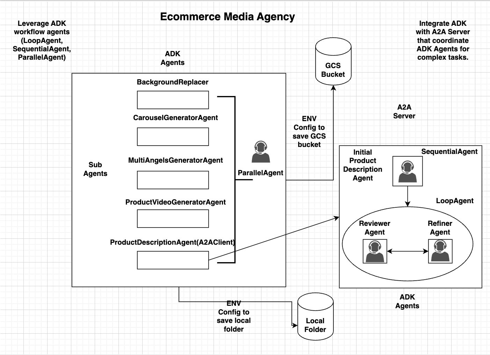

# Ecommerce Media Agency

## I. Introduction:
AI agents that are specialized in creating beautiful content (images, video, and product description) for your product images.

## Key features:

Useful for Ecommerce and Marketing use cases, in which you have thoudsands of product images and the Ecommerce Media Agency will help you to:

1. **White background**: Convert your 1000++ product images with many different backgrounds or distracted background to standard white background (often required by platform like Amazon, EBay, Etsy...)

2. **Multi-angles**: Transform your initial product image into beautiful multi-angles images.

3. **Brand background**: If you want to apply the same (brand) brackground to your 1000++ images

4. **Product Video**: Transform your product images into beautiful product introduction video

5. **Product Description**: Write beautiful product description based on your product images


**Demo video**:  https://www.youtube.com/shorts/mHHoanUd0MQ

[](https://www.youtube.com/shorts/mHHoanUd0MQ))

## Agent Architect:

[Architecture Diagram](docs/ecommerce_media_agency_diagram_full.png)

Ecommerce Media Agency leverages the great [Google Agent Develoment Kit](https://google.github.io/adk-docs/) and [Agent2Agent](https://developers.googleblog.com/en/a2a-a-new-era-of-agent-interoperability/)

to implement multi-agents that specialized in media content generation (image, video, text).

The Ecommerce Media Agency agents can be configured to run locally or processing images stored in Google Cloud Storage.



## How to run:

1. **Clone the source code:**

```bash
gh repo clone tsnguyenducphuong/media-agency
```

2. **Change to media-agency folder:**

3. **Run the following command:**

```bash
python -m venv .venv
```

```bash
source .venv/bin/activate 
```

```bash
pip install -r requirements.txt
```

4. **Change the .env variables: update your Google API Key, etc.**
+ Note that for processing local images, set the environment variable (in .env file) IS_USE_GCS=False

5. **Run command:**

```bach

glound init

gcloud auth application-default login

adk web
```

6. **Navigate to** [http://locahost:8080](http://locahost:8080)

7. **Say hi** to the agent and specify the local folder that contain product images for processing, for example: 
    please use folder: /Users/phuongnguyen/Documents/media-images


## II.Deploy to Cloud Run:
 
```bash
gcloud auth login

gcloud config set project ecommerce-media-agency

```
 
**Set your Google Cloud Project ID:**

```bash
export GOOGLE_CLOUD_PROJECT="ecommerce-media-agency"
```

**Set your desired Google Cloud Location:**

```bash
export GOOGLE_CLOUD_LOCATION="us-central1"  
 ```

**Set a name for your Cloud Run service (optional):**

```bash
export SERVICE_NAME="media-agent-service"
```

**Set an application name (optional):**

```bash
export APP_NAME="media-agent"
```

Assuming 'media-agency' is the current directory in which subfolder is 'media_agent'

**Deploy using adk cli:**

```bash
adk deploy cloud_run \
--project=$GOOGLE_CLOUD_PROJECT \
--region=$GOOGLE_CLOUD_LOCATION \
--service_name=$SERVICE_NAME \
--with_ui \
media_agent
```

**Or deploy using gcloud:**

Update the GOOGLE_API_KEY inside the envvariables.yaml file with your API KEY. Also update the AGENT_URL
to the A2A Server URL (looks like: **https://product-description-agent-86390171XXXX.us-east1.run.app**). Notes: set AGENT_URL=localhost in the .env if you run the [A2A Product Description Server](https://github.com/tsnguyenducphuong/product_description_a2a_server) locally.

```bash

gcloud run deploy media-agent-service \
--source . \
--region $GOOGLE_CLOUD_LOCATION \
--project $GOOGLE_CLOUD_PROJECT \
--allow-unauthenticated \
--env-vars-file=envvariables.yaml

```

**For connect with the A2A Server and Product Description Agents, clone the code with following command:**

```bash
gh repo clone tsnguyenducphuong/product_description_a2a_server
```

Follow the [A2A server README instruction](https://github.com/tsnguyenducphuong/product_description_a2a_server) to configure the A2A Server and Product Description Agents. Have fun!
